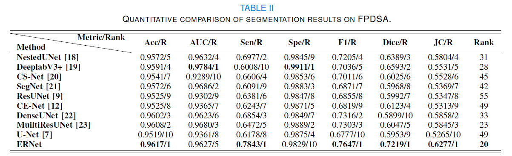

## ERNet &mdash; Official PyTorch Implementation (Code and data will be available soon)
### ERNet: Edge Regularization Network for Cerebral Vessel Segmentation in Digital Subtraction Angiography Images
>
> **Abstract** *Stroke is the leading cause of disability and fatality in the world, with ischemic stroke being the most common type of stroke. Digital Subtraction Angiography (DSA) is the gold standard for the treatment of ischemic stroke, and surgeons still need to visually inspect DSA images in current clinical practice  under the radiation range of X ray. However, due to the differences in doctors' experience, disturbance of imaging parameters, and changes in imaging scale, cerebral vessel segmentation in DSA images is still a challenging problem. In this paper, we propose a novel Edge Regularization Network (ERNet) to segment cerebral vessels in DSA images. Specifically, ERNet employs the erosion process and dilation process on the original binary vessel annotation to generate pseudo-GTs of False Negative (FN) and False Positive (FP), which can provide constraints on the coarse prediction by the mapping relationship between the pseudo-GTs and the original vessels. In addition, we also exploit a Hybrid Fusion Module based on convolution and transformer to extract local features and build long-range dependencies. Moreover, to contribute to the research fields of ischemic stroke research, we also introduce a new cerebral vessel semantic segmentation dataset, FPDSA, which is the first pixel-level semantic segmentation dataset for cerebral vessels. Extensive experiments on  FPDSA illustrate the leading performance of our ERNet.Stroke is the leading cause of disability and fatality in the world, with ischemic stroke being the most common type of stroke. Digital Subtraction Angiography (DSA) is the gold standard for the treatment of ischemic stroke, and surgeons still need to visually inspect DSA images in current clinical practice  under the radiation range of X ray. However, due to the differences in doctors' experience, disturbance of imaging parameters, and changes in imaging scale, cerebral vessel segmentation in DSA images is still a challenging problem. In this paper, we propose a novel Edge Regularization Network (ERNet) to segment cerebral vessels in DSA images. Specifically, ERNet employs the erosion process and dilation process on the original binary vessel annotation to generate pseudo-GTs of False Negative (FN) and False Positive (FP), which can provide constraints on the coarse prediction by the mapping relationship between the pseudo-GTs and the original vessels. In addition, we also exploit a Hybrid Fusion Module based on convolution and transformer to extract local features and build long-range dependencies. Moreover, to contribute to the research fields of ischemic stroke research, we also introduce a new cerebral vessel semantic segmentation dataset, FPDSA, which is the first pixel-level semantic segmentation dataset for cerebral vessels. Extensive experiments on  FPDSA illustrate the leading performance of our ERNet.*

## Architecture

  

---
## FPDSA dataset

  

## Results
### Ablation study

  

  

  

  

  

### Comparison

  

  

